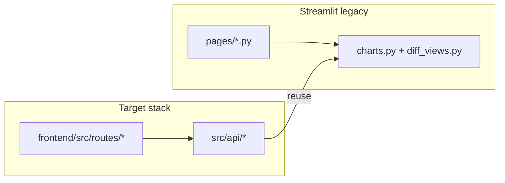
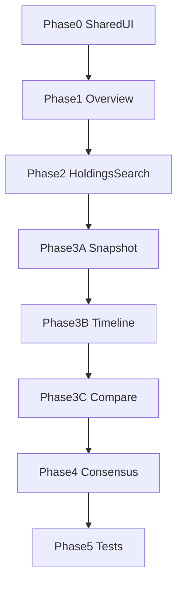

# React Dashboard Parity Plan (Phased)

Restore Streamlit dashboard parity in the React app, page by page (Overview → Holdings Search → Fund Analysis → Consensus Trends), with a thin shared UI foundation first and targeted API extensions only where the backend does not yet expose formatted analytics.

## Todos

- [x] **Phase 0:** Extend DataTable, Charts (GroupedBarChart), SectionHeader, ExportLink, AlertBanner
- [x] **Phase 1:** Overview parity — banners, stats caption, multiplier caption, table/chart polish
- [x] **Phase 2:** Holdings Search parity — issuers KPI, multiplier caption, export, table styling
- [x] **Phase 3A:** Fund Analysis Snapshot — header KPIs, position insight API+UI, snapshot CSV export
- [x] **Phase 3B:** Fund Analysis Timeline — value chart, transition chart, drill-down, history export
- [x] **Phase 3C:** Fund Analysis Compare — quarter picker, highlights, top movers, lanes, formatted diff tables, sankey controls
- [x] **Phase 4:** Consensus Trends parity — section copy, metadata caption, exports, table polish
- [x] **Phase 5:** API tests + build/pytest + manual Streamlit parity checklist

---

## Current state

The React app has all four routes wired, but most pages render **simplified shells**. The FastAPI layer already exposes most raw data; gaps are mainly **frontend wiring** and a few **formatted analytics payloads** that Streamlit built inline.

Reference implementations to match:

- Overview: [`src/web/pages/overview.py`](src/web/pages/overview.py)
- Holdings: [`src/web/pages/holdings_search.py`](src/web/pages/holdings_search.py)
- Fund Analysis: [`src/web/pages/fund_analysis.py`](src/web/pages/fund_analysis.py) + [`src/web/diff_views.py`](src/web/diff_views.py)
- Consensus: [`src/web/pages/consensus_trends.py`](src/web/pages/consensus_trends.py)

Already started: [`frontend/src/utils/dateFormat.ts`](frontend/src/utils/dateFormat.ts) and date-aware cells in [`frontend/src/components/DataTable.tsx`](frontend/src/components/DataTable.tsx).

---

## Phase 0 — Shared UI foundation (small, blocking)

Goal: one reusable presentation layer so each page does not re-implement Streamlit table/chart behavior.

**Frontend**

- Extend [`frontend/src/components/DataTable.tsx`](frontend/src/components/DataTable.tsx):
  - `Type` column badge colors (Purchase / Sell / Call / Put) mirroring [`src/web/instrument_transforms.py`](src/web/instrument_transforms.py)
  - Optional row styling hook for increase/decrease rows (Compare tables)
  - `maxHeight`, sticky header, default column order helpers
- Add small shared components under `frontend/src/components/`:
  - `SectionHeader` (title + caption)
  - `ExportLink` / `DownloadButton` (href to API export routes)
  - `AlertBanner` (info/warning/success for portfolio-value availability, DB warnings)
- Extend [`frontend/src/components/Charts.tsx`](frontend/src/components/Charts.tsx):
  - `formatChartDate` on axis labels (use existing util)
  - `GroupedBarChart` for QoQ transition counts (needed in Fund Analysis Timeline)

**Backend**

- No new routes required in this phase.

**Tests**

- None yet; smoke tests come in Phase 5.

---

## Phase 1 — Overview parity

Match Streamlit Overview section-for-section in [`frontend/src/routes/Overview.tsx`](frontend/src/routes/Overview.tsx).

| Streamlit feature | Action |
|---|---|
| KPI strip (5 metrics + recent-funds caption) | Already mostly present; add `recent_funds` caption |
| Portfolio-value availability banner | Use `has_portfolio_values` from [`/api/overview/funds`](src/api/routers/overview.py) |
| Value-multiplier caption | Surface `value_multiplier_summary` from overview funds payload (already computed in [`src/api/_overview_service.py`](src/api/_overview_service.py)) |
| Feed monitor stats | Fetch [`GET /api/admin/statistics`](src/api/routers/meta.py) and render caption when non-zero |
| Fund table with portfolio value column | Ensure formatted `Portfolio Value` column displays when `has_portfolio_values` |
| Row click → Fund Analysis | Already works; keep query param navigation |
| Bar + line charts | Already present; apply chart date formatting |
| Recent filings + top-held tables | Wire `SectionHeader`, type badges, column order |
| CSV exports | Keep direct links to [`/api/overview/exports/full`](src/api/routers/exports.py) and `/latest`; style as `ExportLink` |

**Backend tweaks (minimal)**

- Confirm [`build_overview_funds`](src/api/_overview_service.py) returns display-ready column names consistent with Streamlit (`Portfolio Value`, `Type`, `Ticker` on top-held via existing transforms).

**Acceptance**

- Side-by-side with `python -m src.main dashboard-streamlit`: Overview shows same KPIs, warnings, tables, and both charts.

---

## Phase 2 — Holdings Search parity

Update [`frontend/src/routes/HoldingsSearch.tsx`](frontend/src/routes/HoldingsSearch.tsx).

| Streamlit feature | Action |
|---|---|
| Search UX + helper caption | Add explicit Search button (keep Enter shortcut) |
| KPIs: matches, funds, latest filing | Add missing **issuers** KPI (`issuers_count` already returned by API) |
| Value-multiplier caption | Display `value_multiplier_summary` from [`/api/holdings/search`](src/api/routers/holdings.py) |
| "Who holds it today" table | Type badges + column order (`Ticker`, `Type`, `Issuer`, …) |
| "All matching rows" table | Same formatting; truncated banner already present |
| CSV download | Add `ExportLink` to [`/api/holdings/search/export?q=…`](src/api/routers/holdings.py) |

**Backend**

- No new endpoints; export route already exists.

**Acceptance**

- Search for a known issuer/CUSIP: same row counts, formatted values, and CSV download as Streamlit.

---

## Phase 3 — Fund Analysis parity (largest page; 3 sub-phases)

Update [`frontend/src/routes/FundAnalysis.tsx`](frontend/src/routes/FundAnalysis.tsx). Keep tabs, but each tab should match Streamlit depth.

### 3A — Header + Snapshot

| Feature | Frontend | Backend |
|---|---|---|
| Fund header KPIs (latest filing, quarters, positions) | Render `headerQuery` fields already returned by [`GET /api/funds/{fund}`](src/api/routers/funds.py) | None |
| `fund_has_db_holdings` warning | Show `AlertBanner` when false | None |
| Snapshot metrics + bar chart + holdings table | Polish with shared table styling | None |
| Value-multiplier caption | Show `value_multiplier` from snapshot payload | None |
| Position insight panel | New UI block: position selector + 4 KPIs + option captions + detail table | **Add** `position_insight` to snapshot response in [`src/api/_fund_service.py`](src/api/_fund_service.py) by extracting logic from `_add_position_insight_columns` / `_render_position_insight` in [`fund_analysis.py`](src/web/pages/fund_analysis.py) (pure data, no Streamlit) |
| Snapshot CSV export | Export link | **Add** `GET /api/funds/{fund}/accessions/{accession}/holdings/export?view=…` returning CSV (mirror Streamlit download) |

### 3B — Timeline

| Feature | Frontend | Backend |
|---|---|---|
| Timeline KPIs with deltas | Compute from `history` + `transitions` in UI or add `summary` block to history payload | Optional small addition to [`build_fund_history_payload`](src/api/_fund_service.py) |
| Quarter history table + CSV export | Table + export link | **Add** `/history/export` route |
| Positions line chart | Already wired | None |
| Portfolio value line chart | Render `charts.value` (already returned, not shown) | None |
| QoQ transition grouped bar chart | New `GroupedBarChart` from `charts.transitions` | Ensure transitions chart payload is Plotly-friendly (may add `charts.transitions_plotly` with melted series) |
| Transition drill-down | Select transition → show 4 count KPIs → button sets Compare tab accession params | None |

### 3C — Compare

| Feature | Frontend | Backend |
|---|---|---|
| Quarter preset (Latest vs previous / Manual) | State for `old_accession` / `new_accession`; pass to all compare queries | Params already on routes |
| Count KPIs | Already present | None |
| Largest new/closed/increase/decrease highlights | KPI row with position captions | **Add** `highlights` to compare payload (extract `_render_compare_highlights` helpers) |
| Top movers table | Render formatted table | **Add** `top_movers` via `_build_top_movers_table` extraction |
| Sankey with controls | Sliders/selects for top N buys/sells, scale mode, min visible % | Extend [`/compare/charts/sankey`](src/api/routers/funds.py) to accept `scale_mode`, `min_visible_pct`, `top_n_buys`, `top_n_sells`; apply [`scale_shares_flow_values`](src/web/charts.py) server-side |
| Share-change lanes chart | New `LanesChart` component (Plotly scatter, data from lanes endpoint) | Endpoint exists; optionally return chart-ready trace bundle |
| Detailed diff tables (new / closed / all changes) | Three sections with styled rows | **Add** `formatted_diff` in compare response by porting [`render_detailed_diff_sections`](src/web/diff_views.py) formatting to pure functions in `src/api/_diff_format.py` (no Streamlit imports) |
| Per-section CSV exports | Export links | **Add** `/compare/export/{section}` routes |

**Acceptance**

- Pick a fund with 4+ quarters: Snapshot insight works, Timeline shows both charts + transition drill-down, Compare matches Streamlit tables/charts for latest vs previous.

---

## Phase 4 — Consensus Trends parity

Update [`frontend/src/routes/ConsensusTrends.tsx`](frontend/src/routes/ConsensusTrends.tsx).

| Streamlit feature | Action |
|---|---|
| Page intro + section descriptions | `SectionHeader` per leaderboard |
| Metadata caption (quarter window + multiplier summary) | Render `metadata.quarters` range + `value_multiplier_summary` |
| Four leaderboards (chart + table) | Already present; apply table styling and ensure API formatted columns display (`Share Delta`, `Value Delta`, etc. from [`consensus.py`](src/api/routers/consensus.py)) |
| Per-leaderboard CSV download | **Add** optional `GET /api/consensus/trends/export?section=…` or reuse trends query client-side export |

**Backend**

- Optional thin export route; formatting logic already in `_prepare_display`.

**Acceptance**

- Same filters as Streamlit produce equivalent top-N rows and chart rankings.

---

## Phase 5 — Verification and hardening

- Add API tests beyond [`tests/test_api_health.py`](tests/test_api_health.py):
  - Overview funds + statistics — [`tests/test_api_parity.py`](tests/test_api_parity.py)
  - Holdings search + export
  - Fund compare formatted payload + sankey params (also covered in [`tests/test_api_fund_analysis.py`](tests/test_api_fund_analysis.py))
  - Consensus trends shape
- Run `npm run build` + `pytest tests/ -v`

### Manual Streamlit parity checklist

Use one fund with 4+ quarters, one search term (e.g. `apple`), and default consensus window (`lookback_quarters=4`).

| Page | Streamlit (`dashboard-streamlit`) | React (`dashboard` + Vite) |
|---|---|---|
| Overview | KPI strip, portfolio-value banner, multiplier caption, feed stats, fund table, charts, recent filings, top-held, CSV exports | Same sections via `/api/overview/*` |
| Holdings Search | Search button, issuers KPI, multiplier caption, who-holds + all-rows tables, CSV export | Same via `/api/holdings/search` |
| Fund Analysis — Snapshot | Header KPIs, DB warning, metrics/chart/table, position insight, snapshot CSV | Tabs + `/api/funds/{fund}/accessions/...` |
| Fund Analysis — Timeline | KPI deltas, quarter table + export, positions + value charts, transition bar chart, drill-down | Timeline tab + history export |
| Fund Analysis — Compare | Quarter picker, count KPIs, highlights, top movers, sankey controls, lanes, diff tables, section exports | Compare tab + compare routes |
| Consensus Trends | Intro copy, metadata caption, four leaderboards (chart + table), per-section CSV | `/api/consensus/trends` + export |

---

## Implementation notes

- **Reuse Python analytics, don't duplicate in TypeScript.** New API helpers should call existing functions in [`src/web/charts.py`](src/web/charts.py), [`src/web/formatting.py`](src/web/formatting.py), and extracted pure formatters from [`fund_analysis.py`](src/web/pages/fund_analysis.py) / [`diff_views.py`](src/web/diff_views.py). Keep `src/api/` free of Streamlit imports.
- **Keep scope tight per phase.** Each phase should be shippable; Streamlit remains available via `dashboard-streamlit` until Phase 5 sign-off.

## Suggested execution order

Estimated relative effort: Phase 0 (small), Phase 1–2 (medium), Phase 3 (large), Phase 4 (medium), Phase 5 (small).
